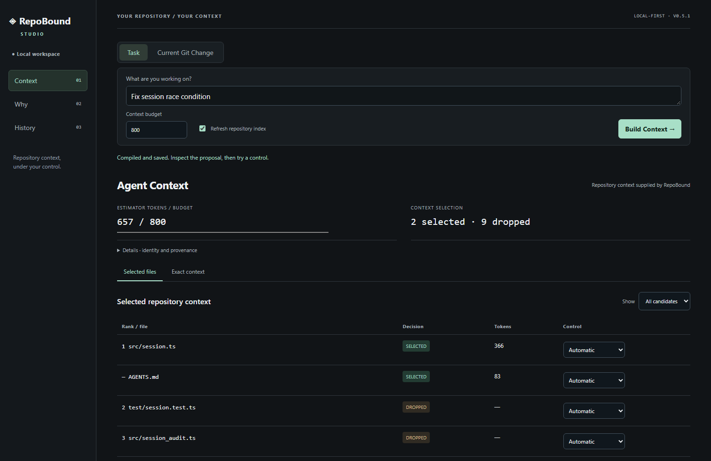
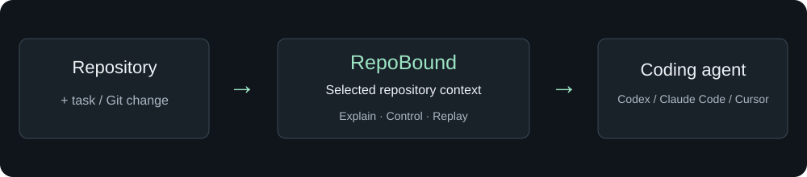
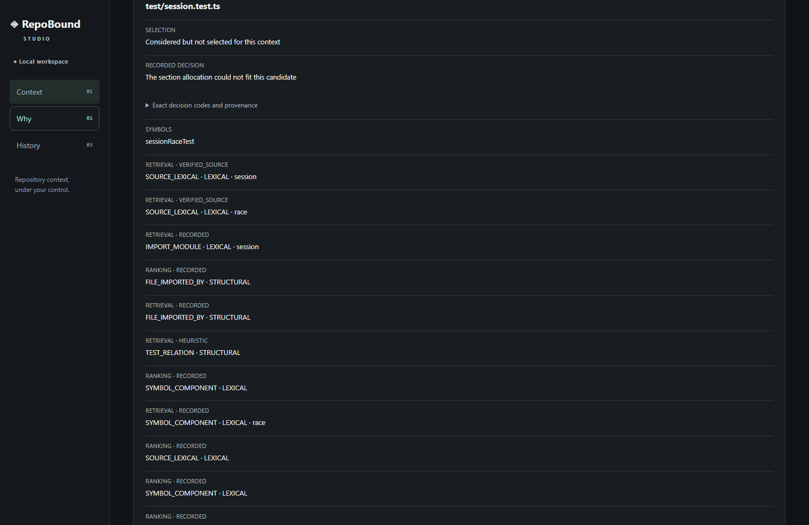

[English](README.md) · [简体中文](README_ZH.md)

# RepoBound

**See and control the repository context your coding agent gets.**

RepoBound is a local-first repository context compiler for coding agents. It finds task-relevant code, builds a bounded context pack, explains what was selected or dropped, and lets you control, compare and replay that context.



[](LICENSE)

> RepoBound is the new name of ContextForge. Existing ContextForge releases remain available, and v0.5.1 preserves the validated engine, serialized contracts and local-state compatibility.

With Node.js **>=24.15 <25**, run in your repository:


```sh
npm install -g @kallist/repobound
repobound studio
```

These are the v0.5.1 release-target commands; `@kallist/repobound` is not public until the final release gate completes. The historical `@kallist/contextforge@0.5.0` package continues to provide the `contextforge` command. RepoBound provides only the canonical `repobound` command, so both packages can coexist during migration.

Agent user? Start with the [Agent integration guide](docs/AGENT_SKILL.md). Studio is the quickest way to see the product; the CLI exposes the full workflow.

## A 30-second tour

1. Enter **Fix session race condition** and build task context.
2. Inspect selected and dropped files, the budget, and **Exact context**.
3. Include a dropped test, rebuild, inspect **Dropped → Selected**, and replay.

The images come from a real local Studio running a synthetic session fixture. They demonstrate context selection, not a model fixing a bug. Reproduce from a checkout with `npm ci`, `npx playwright install chromium`, `npm run build` and `node scripts/launch-assets.mjs` (Linux may require `npx playwright install --with-deps chromium`). The demo uses 800 estimator tokens to expose budget pressure; ordinary tasks default to 8,000 in Studio 2.0.

## Why RepoBound?

A coding task needs a useful slice of repository evidence. RepoBound makes that slice inspectable: what was included, what was dropped, why, and what changes when you apply a control. It produces repository context; your coding agent performs the coding task.

## How it works



Compile what your coding agent sees. Explain it. Control it. Replay it.

This refers to repository context supplied by RepoBound. System instructions, conversation history, host tools and hidden model context are outside its visibility.

## Use with coding agents

| Interface | Use it for |
|---|---|
| [Agent Skill](docs/AGENT_SKILL.md) | Guidance on when to compile, inspect or replay context |
| [MCP](docs/ENGINEERING_REFERENCE.md#mcp-integration) | Structured `status`, `index`, `search` and `pack` in compatible hosts |
| CLI | Full scripting, Review and lifecycle workflows |
| Studio | Visual inspection and human context controls |

RepoBound v0.5.1 includes one canonical Agent Skill. After the repository rename, install it in the project where you want to use it:

```sh
npx skills@1.5.26 add kallist/RepoBound --skill repobound --agent codex --copy --yes
npx skills@1.5.26 list
```

The Skill guides the agent; MCP or the CLI executes RepoBound. Installing the Skill does not install the product. Review uses the CLI. Compatibility with a Skill format does not imply every agent host was tested; the [integration guide](docs/AGENT_SKILL.md) separates candidate validation from post-release verification.

## Context workflow


```sh
repobound index .
repobound pack "Fix session race condition" . --budget 8000 --capsule task.json --out task.md
repobound explain task.json --query WHY_SELECTED --subject src/session.ts
repobound coverage task.json
repobound replay task.json --verify --repository .
```

**Explain** reads recorded selection evidence. **Include / Exclude / Prefer** shape the existing safe candidate proposal. **Rebuild** creates a new immutable Capsule. **Diff** compares recorded changes. **Replay** verifies against current sources. [Control and lifecycle semantics](docs/V0.3_PRODUCT_GUIDE.md).

For a tracked Git change:


```sh
repobound review . --base HEAD --budget 8000 --refresh-index --capsule review.json --out review.md
```

Review traces bounded structural evidence, not complete runtime impact. Stage new files first. Deleted source is metadata only. [Review guide](docs/V0.4_PRODUCT_GUIDE.md).

## See the repository context




## Measured evidence

The frozen offline benchmark measures context selection, not coding-agent success. Results are mixed; no general token-saving or accuracy claim follows. The historical matrix contains 720 cases and the Capsule conformance matrix contains 240. For measured outcomes and limitations, see [V0.2 evidence](docs/V0.2_FINAL_EVALUATION.md) and the [benchmark protocol](docs/BENCHMARK.md).

## Local-first and security

No model API, source upload, telemetry or account is required. Studio binds loopback with a private capability and CSP. History stores compressed metadata, not a source archive. Review packs before forwarding code across your trust boundary. [Security policy](SECURITY.md).

## Current limitations

- Public compiler remains V1. Experimental V2 is internal; V0.5 does not change compiler or ranking behavior.
- Heuristic selection and one-hop Review relationships can miss relevant code. Coverage is not a completeness score.
- Budgets use a declared estimator, not a model-specific tokenizer.
- Replay cannot restore deleted historical source. Remote Studio/MCP and cloud services are not implemented.
- Agent task success and review accuracy are not measured.

## Install and documentation

The release target is `@kallist/repobound@0.5.1` in [kallist/RepoBound](https://github.com/kallist/RepoBound). Before final publication, the current public stable package remains [@kallist/contextforge@0.5.0](https://www.npmjs.com/package/@kallist/contextforge).

[Agent setup](docs/AGENT_SKILL.md) · [Migration guide](docs/brand/MIGRATION_FROM_CONTEXTFORGE.md) · [Lifecycle guide](docs/V0.3_PRODUCT_GUIDE.md) · [Review guide](docs/V0.4_PRODUCT_GUIDE.md) · [Architecture](docs/ARCHITECTURE.md) · [Engineering reference](docs/ENGINEERING_REFERENCE.md) · [Product specification](docs/PRODUCT_SPEC.md)

## Contributing

Read [CONTRIBUTING](CONTRIBUTING.md) for development and validation, and [SECURITY](SECURITY.md) for private vulnerability reporting. Discuss ideas in [Discussions](https://github.com/kallist/RepoBound/discussions) after the repository rename. [MIT licensed](LICENSE).
