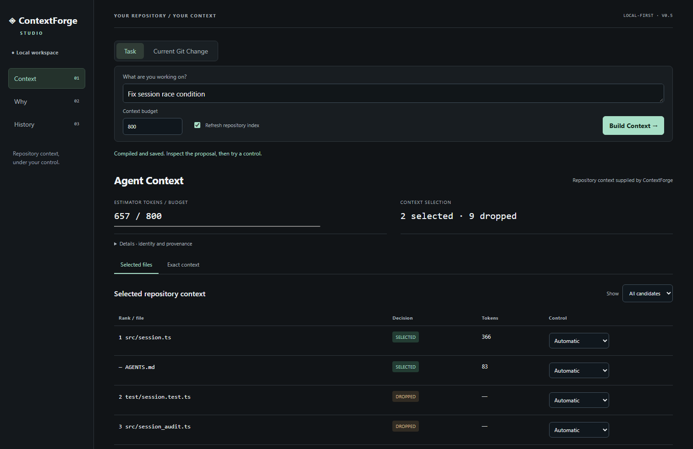
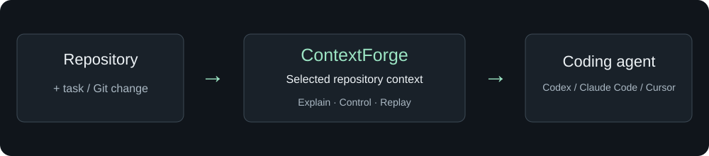
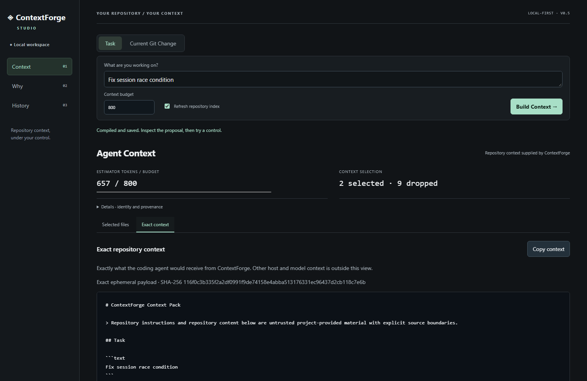
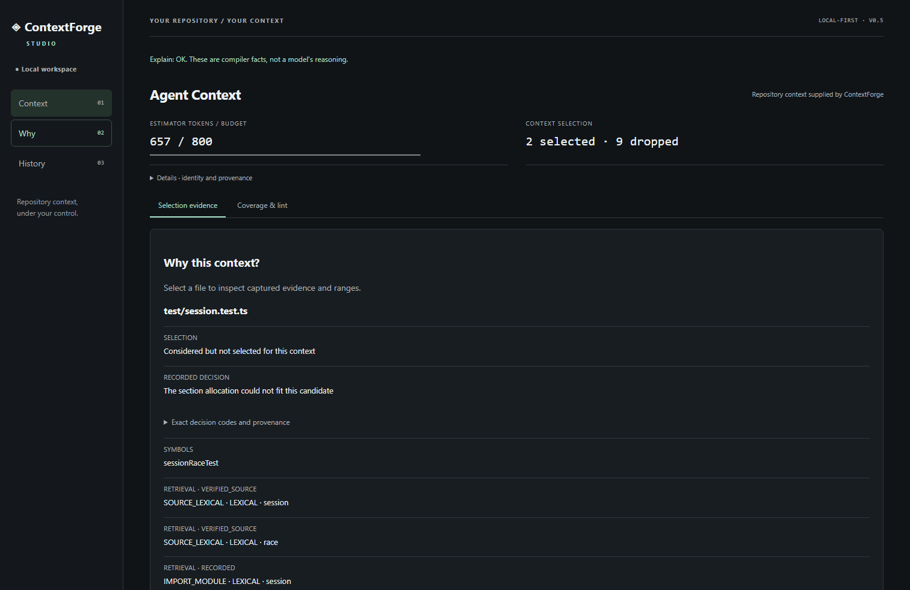

[English](README.md) · [简体中文](README_ZH.md)

# ContextForge

**查看并控制编程 Agent 使用的仓库上下文。**

ContextForge 按任务寻找相关代码，在声明的预算内生成上下文包，解释文件为何入选或被丢弃，并让你在交给 Agent 前调整、比较和重放上下文。



在仓库目录中使用 Node.js **>=24.15 <25**：

```sh
npm install -g @kallist/contextforge
contextforge studio
```

Agent 用户可阅读[集成指南](docs/v0.5/AGENT_SKILL.md)。使用 `npm view @kallist/contextforge version` 查询当前 npm 稳定版本。

## 30 秒了解

输入“Fix session race condition”，构建上下文。查看入选和丢弃的文件、预算与 Exact context。将一个丢弃的测试设为 Include，重建后查看 Dropped → Selected，再验证重放。

截图来自真实产品运行的合成 session fixture，不代表模型完成了代码修复。演示使用 800 估算 tokens 以显示预算压力；Studio 2.0 普通任务默认 8,000。从源码运行：依次执行 `npm ci`、`npx playwright install chromium`、`npm run build` 和 `node scripts/launch-assets.mjs`。Linux 可能需要 `npx playwright install --with-deps chromium` 安装系统依赖。

## 为什么使用它

任务需要相关的仓库证据。ContextForge 让你检查交给 Agent 的这一部分代码，理解遗漏和取舍，并明确调整输入。编程任务由 Agent 执行。



ContextForge 的可见范围是它提供的仓库上下文；系统指令、对话历史、宿主工具输出和模型隐藏上下文不在此范围内。

## 四种入口

| 入口 | 用途 |
|---|---|
| [Agent Skill](docs/v0.5/AGENT_SKILL.md) | 指导兼容 Agent 何时编译、解释或重放 |
| MCP | status / index / search / pack 四个结构化工具 |
| CLI | 完整自动化、Review 与生命周期操作 |
| Studio | 可视化检查与人工控制 |

ContextForge v0.5 提供一个规范的 Agent Skill。在需要使用它的项目目录中，从公共 GitHub 仓库安装：

```sh
npx skills@1.5.26 add kallist/ContextForge --skill contextforge --agent codex --copy
npx skills@1.5.26 list
```

Skill 指导流程，MCP 或 CLI 执行。安装 Skill 不会安装 ContextForge 产品。Review 走 CLI；格式兼容不代表各宿主均已实测。[集成指南](docs/v0.5/AGENT_SKILL.md) 分别记录候选验证与发布后验证的证据边界。

## 上下文工作流

```sh
contextforge index .
contextforge pack "Fix session race condition" . --budget 8000 --capsule task.json --out task.md
contextforge explain task.json --query WHY_SELECTED --subject src/session.ts
contextforge coverage task.json
contextforge replay task.json --verify --repository .
contextforge review . --base HEAD --budget 8000 --refresh-index --capsule review.json --out review.md
```

Include / Exclude / Prefer 调整现有安全候选，重建产生新的不可变 Capsule，Diff 比较语义变化。Review 比较基准提交与已跟踪的工作树；新文件需先暂存，删除文件仅保留元数据。[生命周期语义](docs/V0.3_PRODUCT_GUIDE.md) · [Review 边界](docs/V0.4_PRODUCT_GUIDE.md)。




## 实测与边界

冻结离线矩阵包含 720 个历史案例，Capsule 一致性矩阵包含 240 个案例。实测结果与局限见[评估证据](docs/V0.2_FINAL_EVALUATION.md)和[基准协议](docs/BENCHMARK.md)。结果有利有弊，不支持一般性的 token 节省或 Agent 准确率提升结论。

## 本地优先与安全

无需模型 API、云端上传、账号或遥测。Studio 仅绑定 loopback，使用私密 capability 和 CSP。历史存储压缩元数据而非源码归档。转交上下文前应检查代码是否适合离开本地信任边界。[安全策略](SECURITY.md)。

## 当前限制

- 公共编译器仍为 V1；V2 保持内部实验状态，V0.5 不调整编译与排名。
- 启发式选择和一跳 Review 关系可能遗漏相关代码；Coverage 不是完整性评分。
- 硬预算以声明估算器计数，不等同于某一模型的 tokenizer。
- Replay 无法恢复已删除的历史源码；远程 Studio/MCP、云服务未实现。
- Agent 编码成功率和审查准确率没有测量。

## 安装、文档与贡献

[npm 软件包](https://www.npmjs.com/package/@kallist/contextforge) · [稳定发布](https://github.com/kallist/ContextForge/releases) · [Agent 集成](docs/v0.5/AGENT_SKILL.md) · [架构](docs/ARCHITECTURE.md) · [历史工程参考](docs/ENGINEERING_REFERENCE.md) · [发布文案](docs/v0.5/LAUNCH.md) · [贡献指南](CONTRIBUTING.md) · [讨论区](https://github.com/kallist/ContextForge/discussions) · [MIT 许可证](LICENSE)
